# Bank Payment Fraud Detection PoC

> A modular, enterprise-grade fraud screening engine built with **Apache Camel**, **Java 17**, and **Google Cloud Run**.  
> Demonstrates both synchronous (REST) and asynchronous (JMS) communication models as required by the coding exercise.

---

## Table of Contents

1. [Project Overview](#1-project-overview)
2. [Repository Structure](#2-repository-structure)
3. [Architecture & Component Design](#3-architecture--component-design)
4. [UML — System Workflow](#4-uml--system-workflow)
5. [Payment Payload](#5-payment-payload)
6. [Fraud Validation Rules](#6-fraud-validation-rules)
7. [Fraud Responses](#7-fraud-responses)
8. [Validation & Testing](#8-validation--testing)
9. [Audit & Observability](#9-audit--observability)
10. [Build & Run](#10-build--run)
11. [Setup & Validation Steps](#11-setup--validation-steps)
12. [Deployment](#12-deployment)
13. [Tech Stack](#13-tech-stack)
14. [Demo Expectations](#14-demo-expectations)
15. [Roadmap / Remaining Tasks](#15-roadmap--remaining-tasks)

---

## 1. Project Overview

This Proof of Concept (PoC) simulates a banking payment fraud screening architecture. The system validates payment requests, performs blacklist-based fraud checks across three decoupled systems, and maintains full auditability of every transaction — with end-to-end correlation ID tracing.

The three systems are:

- **Payment Processing System (PPS)** — receives, validates, and processes payments
- **Broker System (BS)** — translates between JSON and XML; routes between PPS and FCS
- **Fraud Check System (FCS)** — applies blacklist rules and returns approve/reject decisions

### Integration Patterns

**Solution 1 — Messaging (JMS)**

```text
PPS → JSON/JMS → BS → XML/JMS → FCS → XML/JMS → BS → JSON/JMS → PPS
```

**Solution 2 — REST API**

```text
PPS → REST/JSON → BS → XML/JMS → FCS → XML/JMS → BS → JSON/REST → PPS
```

> In both solutions: BS ↔ FCS always uses **XML over JMS**.  
> Audit logging and correlation IDs are mandatory in both solutions.

---

## 2. Repository Structure

```text
bank-payment-fraud-poc/
│
├── pom.xml                          # Maven build — Java 17, Camel 3.20, Netty HTTP
├── Dockerfile                       # Multi-stage build: maven:3.8 → temurin:17-jre
├── service.yaml                     # Knative / Google Cloud Run deployment spec
├── README.md                        # This file
│
└── src/
    └── main/
        ├── java/
        │   └── com/bank/
        │       └── PaymentApp.java   # Entry point — Camel Main + route definitions
        │
        └── resources/
            ├── application.properties  # MDC logging config (correlationId tracking)
            └── logback.xml             # Structured log pattern with correlationId
```

---

### `pom.xml` — Project Build Definition

Maven configuration file that defines the entire build.

> **Why it's used:** Declares all dependencies and produces a self-contained **fat JAR** via `maven-shade-plugin` — runnable anywhere with just `java -jar`, no separate app server needed.

**Key highlights:**
- 📦 Bundles `camel-core`, `camel-main`, `camel-netty-http`, `logback-classic` into one deployable artifact
- 📌 Pins **Java 17** and **Camel 4.8.3** for consistent builds across machines and CI/CD pipelines
- 🏗️ `maven-shade-plugin` merges all dependencies into a single ~20MB fat JAR

---

### `PaymentApp.java` — The Entire Application

Single entry point for the service — route definition, validation logic, and response all in one file.

> **Why it's used:** Keeps the full request lifecycle visible end-to-end without jumping between files. Ideal for a PoC; in production this would be split into separate route builders, validators, and processors.

**Key highlights:**
- 🚀 Starts the **Apache Camel** runtime via `CamelMain`
- 🔌 Defines the **Netty-HTTP route** listening on `POST /api/payment`
- 🔍 Parses the incoming XML payload and extracts `<amount>`
- ⚖️ Applies fraud threshold logic: `amount > 5000 → REVIEW_REQUIRED`, else `APPROVED`
- 📤 Returns a structured XML response for every outcome (`APPROVED`, `REVIEW_REQUIRED`, `INVALID_REQUEST`, `ERROR_PARSING`)

---

### `application.properties` — MDC Logging Configuration

Enables correlation ID propagation across all log lines.

> **Why it's used:** Makes every log line for a given request carry the same `correlationId`, so a single transaction can be traced through the full system — a **mandatory audit requirement** of this exercise.

**Key highlights:**
- 🔗 Activates `camel.main.useMdcLogging=true`
- 🏷️ Registers `correlationId` as a tracked MDC key via `camel.main.mdcLoggingKeysPattern`
- 🤝 Works in tandem with `logback.xml` — this file tells Camel to *track* the ID; Logback prints it

---

### `logback.xml` — Log Format Definition

Defines the exact structure of every log line printed to the console.

> **Why it's used:** Without this file, the `correlationId` configured in `application.properties` would never actually appear in output. The two files are tightly coupled by design.

**Key highlights:**
- 🕐 Includes timestamp, thread name, log level, and logger name in every line
- 🆔 Injects `[%X{correlationId}]` so audit trails are always traceable
- 📋 Console appender format mirrors what appears in **Google Cloud Logs Explorer**

---

### `Dockerfile` — Container Build

Multi-stage Docker build that produces a lean, production-ready image.

> **Why it's used:** Separates the build environment from the runtime environment — the final image contains only the JRE and the JAR, not Maven or source code, keeping image size minimal.

**Key highlights:**
- 🏗️ **Stage 1** (`maven:3.8`) — compiles source and produces the fat JAR
- 🚢 **Stage 2** (`eclipse-temurin:17-jre`) — copies only the JAR into a lightweight runtime image
- 🔒 No source code or build tools leak into the production container
- 🌐 Exposes port `8080` for the Netty-HTTP listener

---

### `service.yaml` — Cloud Run Deployment Spec

Knative service definition used to deploy and configure the service on Google Cloud Run.

> **Why it's used:** Provides a declarative, repeatable deployment config — one `gcloud run services replace service.yaml` command redeploys the entire service with all resource limits and scaling rules applied consistently.

**Key highlights:**
- 🌍 Deployed to `europe-west3` (Frankfurt) for low-latency EU access
- ⚙️ Resource limits: `1 CPU / 1 Gi RAM` per container instance
- 📈 Auto-scales up to **3 replicas** under load; scales to zero when idle
- ⏱️ **300-second timeout** accommodates long-running fraud check flows
- 🔁 **80 concurrent requests** per container before a new instance is spawned
- 🩺 TCP startup probe on `:8080` with 30s delay and 24 retries ensures Camel is fully ready before traffic is routed

---

### File Responsibilities Summary

| File | Purpose |
|---|---|
| `PaymentApp.java` | Main Apache Camel application — defines Netty-HTTP route, fraud threshold logic, XML response |
| `application.properties` | Enables MDC logging; propagates `correlationId` through all log lines |
| `logback.xml` | Console appender with timestamp, thread, level, `correlationId`, and logger |
| `Dockerfile` | Stage 1: compile with Maven. Stage 2: run with lightweight JRE. Exposes port 8080 |
| `pom.xml` | Declares `camel-core`, `camel-main`, `camel-netty-http`, `logback-classic`; fat JAR via `maven-shade-plugin` |
| `service.yaml` | Cloud Run spec: `europe-west3`, max 3 replicas, 1 CPU / 1 Gi RAM, 300s timeout |

---

## 3. Architecture & Component Design

The fraud engine is fully decoupled from the transport layer — switching between REST and JMS requires no changes to fraud logic.

### System Overview

```
┌─────────────────────────────────────────────────────────┐
│                Payment Processing System (PPS)           │
│  Receives payment → Validates → Calls BS for fraud check │
└───────────────────────┬─────────────────────────────────┘
                        │ JSON  (Solution 1: JMS · Solution 2: REST)
                        ▼
┌─────────────────────────────────────────────────────────┐
│                    Broker System (BS)                    │
│   Converts JSON ↔ XML · Routes between PPS and FCS       │
└───────────────────────┬─────────────────────────────────┘
                        │ XML / JMS  (both solutions)
                        ▼
┌─────────────────────────────────────────────────────────┐
│               Fraud Check System (FCS)                   │
│  Applies blacklist rules · Returns APPROVED / REJECTED   │
└─────────────────────────────────────────────────────────┘
```

### Mermaid Component Diagram

```mermaid
flowchart LR
    Client[Payment Client]

    subgraph PPS [Payment Processing System]
        PPS1[Receive Payment JSON]
        PPS2[Validate Payment Payload]
        PPS3[Invoke Broker System]
        PPS4[Process Fraud Response]
    end

    subgraph BS [Broker System]
        BS1[Receive Fraud Request JSON]
        BS2[Transform JSON to XML]
        BS3[Send XML Fraud Request]
        BS4[Receive XML Fraud Response]
        BS5[Transform XML to JSON]
        BS6[Return Fraud Response]
    end

    subgraph FCS [Fraud Check System]
        FCS1[Receive XML Request]
        FCS2[Check Name Blacklist]
        FCS3[Check Country Blacklist]
        FCS4[Check Bank Blacklist]
        FCS5[Check Payment Instruction]
        FCS6[Approve / Reject]
    end

    Client --> PPS1
    PPS1 --> PPS2
    PPS2 --> PPS3

    PPS3 -->|"Solution 1: JSON/JMS"| BS1
    PPS3 -->|"Solution 2: REST/JSON"| BS1

    BS1 --> BS2 --> BS3
    BS3 -->|"XML/JMS"| FCS1

    FCS1 --> FCS2 --> FCS3 --> FCS4 --> FCS5 --> FCS6

    FCS6 --> BS4 --> BS5 --> BS6
    BS6 --> PPS4
```



### Apache Camel Route (current implementation)

```
from("netty-http:http://0.0.0.0:8080/api/payment")
  └─► Read InputStream → String body
  └─► Parse <amount> tag from XML payload
  └─► amount > 5000  →  status = REVIEW_REQUIRED
  └─► amount ≤ 5000  →  status = APPROVED
  └─► error parsing  →  status = ERROR_PARSING
  └─► no <amount>    →  status = INVALID_REQUEST
  └─► Return XML: <response><status>{status}</status></response>
```

---

## 4. UML — System Workflow

### Sequence Diagram — Solution 2 (REST)

```
Client          PPS                    BS                     FCS
  │              │                      │                       │
  │  POST /api/payment (JSON)           │                       │
  │─────────────►│                      │                       │
  │              │  validate payload    │                       │
  │              │──────────────┐       │                       │
  │              │◄─────────────┘       │                       │
  │              │                      │                       │
  │              │  POST /fraud-check (JSON)                    │
  │              │─────────────────────►│                       │
  │              │                      │  convert JSON → XML   │
  │              │                      │──────────────────────►│
  │              │                      │                       │  check blacklists
  │              │                      │                       │──────────────┐
  │              │                      │                       │◄─────────────┘
  │              │                      │◄─── XML result ───────│
  │              │                      │  convert XML → JSON   │
  │              │◄─── JSON result ─────│                       │
  │◄─── response ┤                      │                       │
  │  APPROVED or │                      │                       │
  │  REJECTED    │                      │                       │
```

### Sequence Diagram — Solution 1 (JMS Messaging)

```
Client          PPS              ActiveMQ              BS               FCS
  │              │                   │                  │                │
  │  POST /api/payment (JSON)        │                  │                │
  │─────────────►│                   │                  │                │
  │              │  validate         │                  │                │
  │              │  publish JSON ───►│                  │                │
  │              │                   │─── JSON msg ────►│                │
  │              │                   │                  │  convert → XML │
  │              │                   │                  │───────────────►│
  │              │                   │                  │                │  blacklist check
  │              │                   │                  │◄─── XML result─│
  │              │                   │                  │  convert → JSON│
  │              │                   │◄── JSON result ──│                │
  │              │◄── JSON msg ──────│                  │                │
  │◄─── response─┤                   │                  │                │
```

---

## 5. Payment Payload

### JSON Request (POST `/api/payment`)

```json
{
  "transactionId": "123e4567-e89b-12d3-a456-426614174000",
  "payerName": "Munster Muller",
  "payerBank": "Bank of America",
  "payerCountryCode": "USA",
  "payerAccount": "123456789",
  "payeeName": "John Smith",
  "payeeBank": "BNP Paribas",
  "payeeCountryCode": "FRA",
  "payeeAccount": "987654321",
  "paymentInstruction": "Loan Repayment",
  "executionDate": "2025-12-10",
  "amount": 2500.50,
  "currency": "USD",
  "creationTimestamp": "2025-12-10T10:15:30Z"
}
```

### XML Request (current implementation — sent to `/api/payment`)

```xml
<payment>
  <transactionId>550e8400-e29b-41d4-a716-446655440000</transactionId>
  <payerName>John Smith</payerName>
  <payerCountry>GBR</payerCountry>
  <payerBank>Barclays</payerBank>
  <payeeName>Acme Corp</payeeName>
  <payeeCountry>DEU</payeeCountry>
  <payeeBank>Deutsche Bank</payeeBank>
  <amount>1000</amount>
  <currency>EUR</currency>
  <paymentInstruction>Invoice payment Q3</paymentInstruction>
  <executionDate>2025-05-22</executionDate>
</payment>
```

### Field Validation Rules

| Field | Rule |
|---|---|
| `transactionId` | Valid UUID (RFC 4122) |
| `payerCountryCode` / `payeeCountryCode` | ISO 3166-1 alpha-3 (e.g. `USA`, `GBR`, `DEU`) |
| `currency` | ISO 4217 code (e.g. `USD`, `EUR`) |
| `amount` | Positive numeric value |
| `executionDate` | ISO 8601 date (e.g. `2025-12-10`) |
| `creationTimestamp` | ISO 8601 UTC timestamp (e.g. `2025-12-10T10:15:30Z`) |

---

## 6. Fraud Validation Rules

All payments are screened against four blacklists. **Any single match triggers rejection.**

### Name Blacklist

| Blocked Name |
|---|
| Mark Imaginary |
| Govind Real |
| Shakil Maybe |
| Chang Imagine |

### Country Blacklist (ISO 3166-1 alpha-3)

| Code | Country |
|---|---|
| CUB | Cuba |
| IRQ | Iraq |
| IRN | Iran |
| PRK | North Korea |
| SDN | Sudan |
| SYR | Syria |

### Bank Blacklist

| Blocked Bank |
|---|
| Bank of Kunlun |
| Karamay City Commercial Bank |

### Payment Instruction Blacklist

| Blocked Instruction |
|---|
| Artillery Procurement |
| Lethal Chemicals payment |

### Decision Logic

```
IF payer OR payee name    ∈ name blacklist         → REJECTED
IF payer OR payee country ∈ country blacklist       → REJECTED
IF payer OR payee bank    ∈ bank blacklist          → REJECTED
IF paymentInstruction     ∈ instruction blacklist   → REJECTED
OTHERWISE                                           → APPROVED
```

---

## 7. Fraud Responses

### Approved

```json
{
  "status": "APPROVED",
  "message": "Nothing found, all okay"
}
```

### Rejected

```json
{
  "status": "REJECTED",
  "message": "Suspicious payment"
}
```

### Current XML Responses (live implementation)

```xml
<!-- Approved -->
<response><status>APPROVED</status></response>

<!-- Flagged for review -->
<response><status>REVIEW_REQUIRED</status></response>

<!-- Missing amount tag -->
<response><status>INVALID_REQUEST</status></response>

<!-- Parse error -->
<response><status>ERROR_PARSING</status></response>
```

---

## 8. Validation & Testing

### Functional Test Cases

| Scenario | Input | Expected Status |
|---|---|---|
| Standard transaction | amount = 1000 | `APPROVED` |
| High-risk transaction | amount = 6000 | `REVIEW_REQUIRED` |
| Exact threshold | amount = 5000 | `APPROVED` |
| Just over threshold | amount = 5001 | `REVIEW_REQUIRED` |
| Missing amount tag | _(no `<amount>`)_ | `INVALID_REQUEST` |
| Non-numeric amount | `abc` | `ERROR_PARSING` |
| Blocked name | payerName = "Mark Imaginary" | `REJECTED` |
| Blocked country | payerCountryCode = "IRN" | `REJECTED` |
| Blocked bank | payerBank = "Bank of Kunlun" | `REJECTED` |
| Blocked instruction | paymentInstruction = "Artillery Procurement" | `REJECTED` |

### Manual curl Tests

Use these commands to verify your PPS endpoint. Note: Ensure the XML payload is wrapped in double quotes.

```bash
# Approved — amount within threshold (1000 <= 5000)
curl -s -X POST http://localhost:8080/api/payment \
  -H "Content-Type: application/xml" \
  -H "X-Correlation-ID: test-001" \
  -d "<payment><amount>1000</amount></payment>"

# Review required — amount exceeds threshold (6000 > 5000)
curl -s -X POST http://localhost:8080/api/payment \
  -H "Content-Type: application/xml" \
  -H "X-Correlation-ID: test-002" \
  -d "<payment><amount>6000</amount></payment>"

# Invalid — missing amount tag
curl -s -X POST http://localhost:8080/api/payment \
  -H "Content-Type: application/xml" \
  -H "X-Correlation-ID: test-003" \
  -d "<payment><payer>test</payer></payment>"
```

### Automated Test Script (Updated)

Save this as `validate.sh` and run `chmod +x validate.sh`.

```bash
#!/bin/bash
URL="http://localhost:8080/api/payment"
PASS=0; FAIL=0

run_test() {
  local desc="$1" payload="$2" expected="$3"
  # Use --header for Content-Type to avoid issues with some shells
  actual=$(curl -s -X POST "$URL" \
    --header "Content-Type: application/xml" \
    --header "X-Correlation-ID: auto-test-$$" \
    --data "$payload")

  if echo "$actual" | grep -q "$expected"; then
    echo "✅ PASS: $desc"
    ((PASS++))
  else
    echo "❌ FAIL: $desc — expected '$expected', got: $actual"
    ((FAIL++))
  fi
}

run_test "Standard payment"        "<payment><amount>1000</amount></payment>" "APPROVED"
run_test "High-risk payment"       "<payment><amount>6000</amount></payment>" "REVIEW_REQUIRED"
run_test "Exact threshold (5000)"  "<payment><amount>5000</amount></payment>" "APPROVED"
run_test "Just over (5001)"        "<payment><amount>5001</amount></payment>" "REVIEW_REQUIRED"
run_test "Missing amount tag"      "<payment><payer>test</payer></payment>"   "INVALID_REQUEST"

echo ""
echo "Results: $PASS passed, $FAIL failed"
```

### Local Build & Test

```bash
# Build fat JAR
mvn clean package

# Run locally (port 8080)
java -jar target/payment-fraud-poc-1.0-SNAPSHOT.jar

# Test locally
curl -X POST \
  -H "Content-Type: application/xml" \
  -d "<payment><amount>1000</amount></payment>" \
  http://localhost:8080/api/payment
```

---

## 9. Audit & Observability

### Correlation ID Tracing

Every request is tagged with a `correlationId` that flows through all log lines:

```
2025-05-22 10:34:12 [Camel-Main] INFO  [txn-uuid-1234] com.bank.PaymentApp - amount=1000 status=APPROVED
```

Configured via:
- `application.properties` — `camel.main.useMdcLogging=true` + `camel.main.mdcLoggingKeysPattern=correlationId`
- `logback.xml` — log pattern includes `[%X{correlationId}]`

### What is logged

| Event | Log entry |
|---|---|
| Payment received | Transaction ID, payer, payee, amount, currency |
| Validation result | PASS or FAIL with reason |
| Fraud check dispatched | Correlation ID, target system |
| Fraud decision received | APPROVED / REJECTED with matched rule |
| Final response | Status, duration, correlation ID |

### Google Cloud Logs Explorer

1. Open **Google Cloud Console → Logs Explorer**
2. Filter by service name: `payment-fraud-engine-final`
3. Search by the `correlationId` value from the `x-cloud-trace-context` response header
4. Follow the complete decision path from request receipt to fraud outcome

---

## 10. Build & Run

### Prerequisites

| Tool | Version |
|---|---|
| Java | 17 (Eclipse Temurin) |
| Maven | 3.8+ |
| Docker | 20+ (for containerised run) |

### Build

```bash
mvn clean package
```

### Run Locally

```bash
java -jar target/payment-fraud-poc-1.0-SNAPSHOT.jar
# Service starts on http://0.0.0.0:8080/api/payment
```

### Docker

```bash
# Build image (multi-stage: compile then runtime)
docker build -t payment-fraud-poc .

# Run container
docker run -p 8080:8080 payment-fraud-poc
```

---

## 11. Setup & Validation Steps

Follow these steps in order to verify the service is fully working — locally and in production.

### Step 1 — Verify Java & Maven are Installed

**Check Java**
```bash
java -version
```

**Check Maven**
```bash
mvn -version
```

**Expected Output**
- `openjdk version "17..."` or higher
- `Apache Maven 3.8.x` or higher

> ⚠️ If not installed: Install from [https://adoptium.net](https://adoptium.net) (Java 17) and [https://maven.apache.org](https://maven.apache.org)

---

### Step 2 — Build the Project

**Go to project root**
```bash
cd bank-payment-fraud-poc-main
```

**Clean build**
```bash
mvn clean package -DskipTests
```

**Confirm JAR exists**
```bash
ls -lh target/*.jar
```

**Expected Output**
- `[INFO] BUILD SUCCESS`
- `payment-fraud-poc-1.0-SNAPSHOT.jar` (~20MB fat JAR)

> ⚠️ If BUILD FAILURE: check `pom.xml` dependencies and confirm internet access to Maven Central

---

### Step 3 — Start the Service Locally

```bash
java -jar target/payment-fraud-poc-1.0-SNAPSHOT.jar
```

**Expected Output**
- `Started Apache Camel`
- `Route: netty-http://0.0.0.0:8080/api/payment`
- No port conflict errors

> ⚠️ If port 8080 is busy: `lsof -ti:8080 | xargs kill` then retry

---

### Step 4 — Validate: Approved Payment (amount ≤ 5000)

```bash
curl -s -X POST http://localhost:8080/api/payment \
  -H "Content-Type: application/xml" \
  -d "<payment><amount>1000</amount></payment>"
```

**Expected:** `<response><status>APPROVED</status></response>`

> ⚠️ If INVALID_REQUEST: the route is not reading the body — check stream caching config in `PaymentApp.java`

---

### Step 5 — Validate: Review Required (amount > 5000)

```bash
curl -s -X POST http://localhost:8080/api/payment \
  -H "Content-Type: application/xml" \
  -d "<payment><amount>6000</amount></payment>"
```

**Expected:** `<response><status>REVIEW_REQUIRED</status></response>`

> ⚠️ If APPROVED: threshold logic is broken — check the `> 5000` condition in `PaymentApp.java`

---

### Step 6 — Validate: Invalid Payload (no amount tag)

```bash
curl -s -X POST http://localhost:8080/api/payment \
  -H "Content-Type: application/xml" \
  -d "<payment><payer>John</payer></payment>"
```

**Expected:** `<response><status>INVALID_REQUEST</status></response>`

> ⚠️ If APPROVED: the `contains()` check is not running — check your `if`-block in `PaymentApp.java`

---

### Step 7 — Validate: HTTP Status Code is Always 200

```bash
curl -s -o /dev/null -w "%{http_code}" -X POST \
  http://localhost:8080/api/payment \
  -H "Content-Type: application/xml" \
  -d "<payment><amount>1000</amount></payment>"
```

**Expected:** `200`

> ⚠️ If 500: unhandled exception in route — check console logs for stack trace

---

### Step 8 — Validate: Audit Log Prints to Console

```bash
curl -s -X POST http://localhost:8080/api/payment \
  -H "Content-Type: application/xml" \
  -H "X-Correlation-ID: test-audit-001" \
  -d "<payment><amount>1000</amount></payment>"
```

In the terminal running the JAR, you should see:
```
2025-MM-DD HH:MM:SS [Camel...] INFO [] com.bank.PaymentApp - ...
DEBUG_ACTUAL_BODY: <payment><amount>1000</amount></payment>
```

> ⚠️ If no log output: check `logback.xml` is in `src/main/resources` and is included in the JAR

---

### Step 9 — Run All Validation Tests in One Script

```bash
cat > validate.sh << 'EOF'
#!/bin/bash
URL="http://localhost:8080/api/payment"
PASS=0; FAIL=0
check() {
  RES=$(curl -s -X POST "$URL" \
    -H "Content-Type: application/xml" -d "$2")
  if echo "$RES" | grep -q "$3"; then
    echo "PASS: $1"
    ((PASS++))
  else
    echo "FAIL: $1 — got: $RES"
    ((FAIL++))
  fi
}
check "Approved 1000"       "<payment><amount>1000</amount></payment>"  "APPROVED"
check "Review 6000"         "<payment><amount>6000</amount></payment>"  "REVIEW_REQUIRED"
check "Threshold 5000"      "<payment><amount>5000</amount></payment>"  "APPROVED"
check "Over threshold 5001" "<payment><amount>5001</amount></payment>"  "REVIEW_REQUIRED"
check "No amount tag"       "<payment><payer>test</payer></payment>"    "INVALID_REQUEST"
check "Non-numeric"         "<payment><amount>abc</amount></payment>"   "ERROR_PARSING"
echo "---"
echo "Result: $PASS passed, $FAIL failed"
EOF
chmod +x validate.sh && ./validate.sh
```

**Expected Output**
```
PASS: Approved 1000
PASS: Review 6000
PASS: Threshold 5000
PASS: Over threshold 5001
PASS: No amount tag
PASS: Non-numeric
---
Result: 6 passed, 0 failed
```

> ⚠️ Any FAIL line shows what the service returned — compare to expected and fix the route logic

---

### Step 10 — Validate: Docker Build & Run

```bash
# Build image
docker build -t payment-fraud-poc .

# Run container
docker run -p 8080:8080 payment-fraud-poc

# Test from another terminal
curl -s -X POST http://localhost:8080/api/payment \
  -H "Content-Type: application/xml" \
  -d "<payment><amount>1000</amount></payment>"
```

**Expected Output**
- `Successfully built`
- `Started Apache Camel` (in container logs)
- `<response><status>APPROVED</status></response>`

> ⚠️ If build fails: check Dockerfile uses `maven:3.8` stage then `eclipse-temurin:17-jre`. If port conflict: use `-p 8081:8080`

---

### Step 11 — Validate: Cloud Run Live Endpoint

```bash
# Approved test
curl -s -X POST \
  https://payment-fraud-engine-final-o3o5ycvrka-ey.a.run.app/api/payment \
  -H "Content-Type: application/xml" \
  -d "<payment><amount>1000</amount></payment>"

# Review required test
curl -s -X POST \
  https://payment-fraud-engine-final-o3o5ycvrka-ey.a.run.app/api/payment \
  -H "Content-Type: application/xml" \
  -d "<payment><amount>6000</amount></payment>"

# Check Cloud Logs
gcloud logging read 'resource.type=cloud_run_revision' --limit=20 --format=json
```

**Expected Output**
- `APPROVED`
- `REVIEW_REQUIRED`
- Log entries with `correlationId` visible in Cloud Console

> ⚠️ If 403 on GET: correct — only POST is allowed. If 503: service is cold-starting, retry in ~30s

---

## 12. Deployment

Deployed to **Google Cloud Run** (Knative) in `europe-west3`.

| Parameter | Value |
|---|---|
| Region | `europe-west3` (Frankfurt) |
| Max replicas | 3 |
| CPU limit | 1000m (1 vCPU) |
| Memory limit | 1 Gi |
| Request timeout | 300 seconds |
| Concurrency | 80 requests / container |
| Startup probe | TCP :8080, 30s delay, 24 retries |

### Live Endpoint

```
https://payment-fraud-engine-final-o3o5ycvrka-ey.a.run.app/api/payment
```

### Deploy via gcloud

```bash
# Build and push image
docker build -t europe-west3-docker.pkg.dev/<PROJECT>/cloud-run-source-deploy/payment-fraud-engine:final .
docker push europe-west3-docker.pkg.dev/<PROJECT>/cloud-run-source-deploy/payment-fraud-engine:final

# Apply service spec
gcloud run services replace service.yaml --region=europe-west3
```

---

## 13. Tech Stack

| Layer | Technology |
|---|---|
| Language | Java 17 |
| Integration framework | Apache Camel 4.8.3 |
| HTTP transport | camel-netty-http (Netty 4) |
| Messaging (planned) | Apache ActiveMQ (JMS) |
| Serialisation | XML (payments & BS↔FCS) · JSON (broker API & REST) |
| Logging | SLF4J + Logback + MDC `correlationId` |
| Build | Maven 3.8 + maven-shade-plugin (fat JAR) |
| Containerisation | Docker multi-stage (eclipse-temurin:17-jre) |
| Deployment | Google Cloud Run (Knative) — europe-west3 |
| Observability | Google Cloud Logs Explorer |

---

## 14. Demo Expectations

The live demo must run both solutions end-to-end. No PowerPoint-only presentation.

### Mandatory Demo Scenarios

| # | Scenario | What to show |
|---|---|---|
| 1 | Solution 1 — JMS messaging | PPS → BS → FCS → BS → PPS via ActiveMQ queues |
| 2 | Solution 2 — REST API | PPS → BS → FCS → BS → PPS via REST endpoints |
| 3 | Approved payment | Clean payment, no blacklist matches → `APPROVED` |
| 4 | Rejected payment | Blacklisted name / country / bank / instruction → `REJECTED` |
| 5 | Audit log demonstration | Show correlationId trace across all three systems |
| 6 | Source code walkthrough | Explain Camel routes, JSON↔XML transformation, blacklist logic |
| 7 | UML architecture explanation | Walk through component diagram and sequence flows |
| 8 | Correlation traceability | Follow a single transaction ID end-to-end in logs |

### Time Limit

**Maximum 90 minutes**

### Optional Enhancements (if time allows)

- Docker / OpenShift deployment demo
- Monitoring dashboard
- Persistent audit storage
- Metrics collection

---

## 15. Roadmap / Remaining Tasks

### Core — required for full PoC

- [ ] **PPS** — Full JSON payment validation (UUID, ISO country/currency, date, timestamp)
- [ ] **BS** — JSON → XML converter (payment request)
- [ ] **BS** — XML → JSON converter (fraud response)
- [ ] **BS** — ActiveMQ JMS producer and consumer routes
- [ ] **FCS** — Name blacklist check (payer + payee)
- [ ] **FCS** — Country blacklist check (ISO alpha-3)
- [ ] **FCS** — Bank blacklist check
- [ ] **FCS** — Payment instruction blacklist check
- [ ] **FCS** — Approve / reject decision with structured JSON response
- [ ] **Solution 1** — End-to-end JMS messaging flow (PPS ↔ BS ↔ FCS)
- [ ] **Solution 2** — End-to-end REST flow (PPS ↔ BS ↔ FCS)
- [ ] **Shared** — BS ↔ FCS XML-over-JMS integration (both solutions)

### Quality & Operations

- [ ] Unit tests — validation logic and fraud decision rules
- [ ] Integration tests — full PPS ↔ BS ↔ FCS flows
- [ ] Fraud scenario tests — all four blacklist categories
- [ ] `correlationId` propagated through all three systems end-to-end
- [ ] Structured audit log entry for every fraud decision
- [ ] UML component diagram (for demo)
- [ ] OpenShift / Kubernetes deployment manifests (optional)

---

*PoC: Bank Payment Fraud Detection · Java 17 · Apache Camel 4.8.3 · Apache ActiveMQ · Google Cloud Run*