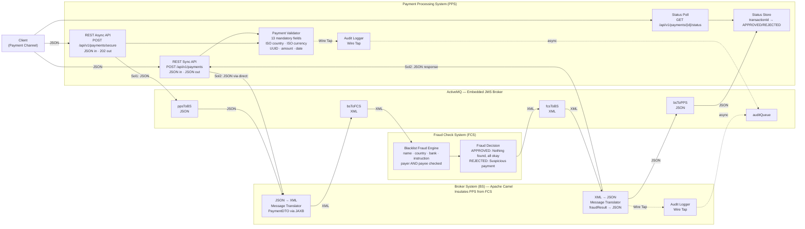
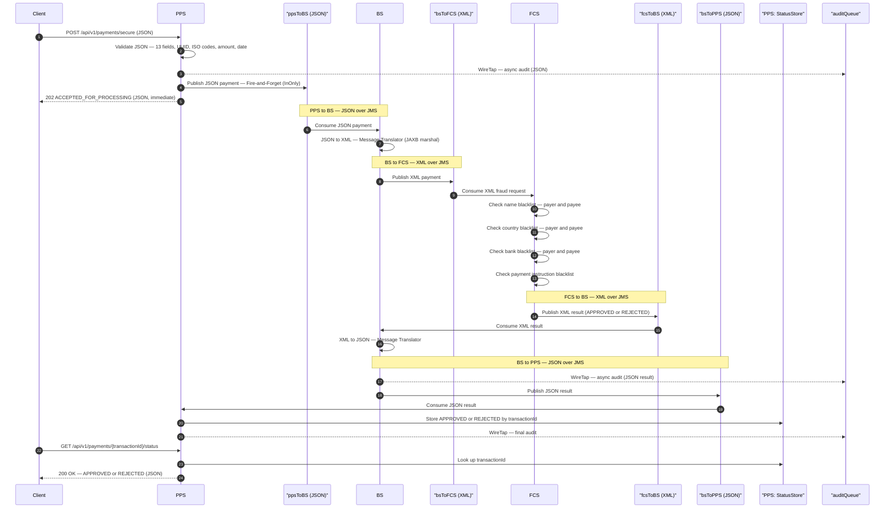
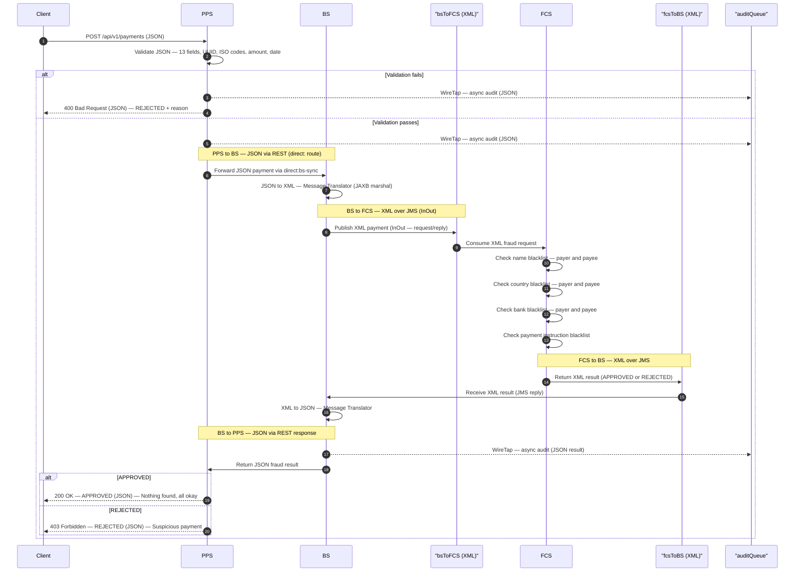
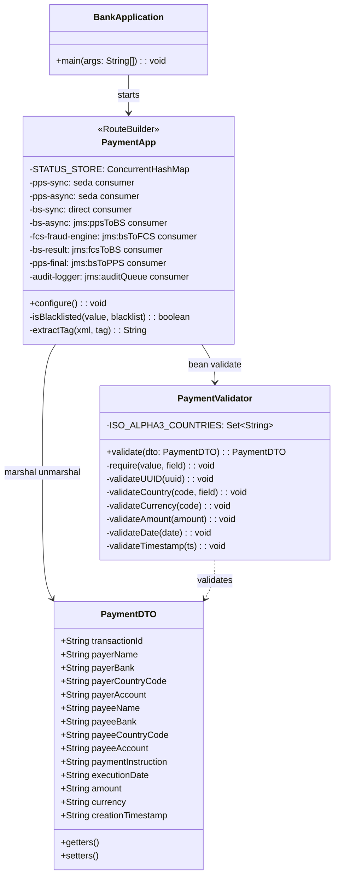

# Bank Payment Fraud Detection PoC

> **Java 17 · Apache Camel 4.8 · ActiveMQ 6 · JMS + REST · Enterprise Integration Patterns**

---

## PoC Objective

This PoC mocks and demonstrates a secure, decoupled payment fraud screening workflow across three systems:

| System | Role |
|---|---|
| **PPS** — Payment Processing System | Receives JSON payments, validates all fields, invokes BS, processes result |
| **BS** — Broker System | Insulates PPS from FCS — converts JSON↔XML, routes via JMS |
| **FCS** — Fraud Check System | Receives XML from BS, applies blacklist rules, returns XML result |

### Two Solutions Required

| | PPS ↔ BS | BS ↔ FCS |
|---|---|---|
| **Solution 1** | Messaging (JMS) + **JSON** | Messaging (JMS) + **XML** |
| **Solution 2** | REST API + **JSON** | Messaging (JMS) + **XML** |

> **PPS always communicates in JSON only.**
> XML is only used on the BS ↔ FCS leg.
> The BS is responsible for all JSON↔XML translation.

### System Responsibilities (from exercise spec)

**PPS — Payment Processing System**
1. Receives a payment **in JSON** for processing
2. Performs basic validation — valid ISO country code, valid ISO currency code, UUID, amount, date
3. Invokes the Broker System (BS) for a fraud check
4. Processes the payment after the fraud check based on approval or rejection from BS

**BS — Broker System**
1. Receives fraud check request **in JSON** from PPS — converts to XML
2. Sends payment **in XML** to FCS for fraud check
3. Receives fraud check result **in XML** from FCS
4. Converts result to **JSON** and sends it back to PPS

**FCS — Fraud Check System**
1. Receives fraud check request **in XML** from BS
2. Checks payer and payee details (name, country, bank) and payment instruction
3. Approves or rejects the payment
4. Sends the fraud check result **in XML** back to BS

---

## Table of Contents

1. [Integration Solutions](#1-integration-solutions)
2. [UML Component Diagram](#2-uml-component-diagram)
3. [UML Sequence Diagram — Solution 1 (JMS)](#3-uml-sequence-diagram--solution-1-jms)
4. [UML Sequence Diagram — Solution 2 (REST)](#4-uml-sequence-diagram--solution-2-rest)
5. [Class Diagram — Core Components](#5-class-diagram--core-components)
6. [Payment Payload](#6-payment-payload)
7. [Fraud Rules](#7-fraud-rules)
8. [Project Structure](#8-project-structure)
9. [Tech Stack](#9-tech-stack)
10. [Build & Run](#10-build--run)
11. [Validate Each Requirement](#11-validate-each-requirement)
12. [Camel EIP Patterns Used](#12-camel-eip-patterns-used)
13. [Final Status Report](#13-final-status-report)

---

## 1. Integration Solutions

### Solution 1 — JMS Messaging Flow

```
Client → POST /api/v1/payments/secure  (JSON)
  PPS: validate JSON → Wire Tap audit → publish JSON to jms:ppsToBS
  PPS → Client: 202 ACCEPTED_FOR_PROCESSING  (immediate)

  BS:  consume JSON from ppsToBS
  BS:  JSON → XML  (Message Translator / JAXB)
  BS:  publish XML to jms:bsToFCS

  FCS: consume XML from bsToFCS
  FCS: run all 4 blacklist checks
  FCS: publish XML result to jms:fcsToBS

  BS:  consume XML from fcsToBS
  BS:  XML → JSON  (Message Translator)
  BS:  Wire Tap audit → publish JSON to jms:bsToPPS

  PPS: consume JSON from bsToPPS
  PPS: store APPROVED / REJECTED → Wire Tap audit

Client → GET /api/v1/payments/{transactionId}/status → APPROVED / REJECTED
```

### Solution 2 — REST API Flow

```
Client → POST /api/v1/payments  (JSON)
  PPS: validate JSON → Wire Tap audit

  BS:  JSON → XML  (Message Translator, via direct: route)

  FCS: run all 4 blacklist checks → XML result

  BS:  XML → JSON  (Message Translator)
  BS:  Wire Tap audit

  PPS → Client: 200 APPROVED | 400 validation error | 403 REJECTED  (JSON)
```

---

## 2. UML Component Diagram

> Format rules from exercise spec:
> - Client → PPS: **JSON only**
> - PPS ↔ BS: **JSON** (JMS in Sol1, REST in Sol2)
> - BS ↔ FCS: **XML over JMS** (both solutions)



---

## 3. UML Sequence Diagram — Solution 1 (JMS)

> PPS ↔ BS: **JSON over JMS**
> BS ↔ FCS: **XML over JMS**



---

## 4. UML Sequence Diagram — Solution 2 (REST)

> PPS ↔ BS: **JSON over REST** (via Camel direct: route)
> BS ↔ FCS: **XML over JMS** (same as Solution 1)



---

## 5. Class Diagram — Core Components



---

## 6. Payment Payload

> **PPS accepts JSON only.** BS converts JSON to XML internally before sending to FCS.
> The XML format below is never exposed to the client.

### JSON Request — Client to PPS

```json
{
  "transactionId":      "550e8400-e29b-41d4-a716-446655440000",
  "payerName":          "John Smith",
  "payerBank":          "Bank of America",
  "payerCountryCode":   "GBR",
  "payerAccount":       "123456789",
  "payeeName":          "Jane Doe",
  "payeeBank":          "BNP Paribas",
  "payeeCountryCode":   "DEU",
  "payeeAccount":       "987654321",
  "paymentInstruction": "Salary",
  "executionDate":      "2025-05-22",
  "amount":             "1500.00",
  "currency":           "EUR",
  "creationTimestamp":  "2025-05-22T09:00:00Z"
}
```

### XML Format — BS to FCS (internal only, not exposed to client)

```xml
<payment>
  <transactionId>550e8400-e29b-41d4-a716-446655440000</transactionId>
  <payerName>John Smith</payerName>
  <payerBank>Bank of America</payerBank>
  <payerCountryCode>GBR</payerCountryCode>
  <payerAccount>123456789</payerAccount>
  <payeeName>Jane Doe</payeeName>
  <payeeBank>BNP Paribas</payeeBank>
  <payeeCountryCode>DEU</payeeCountryCode>
  <payeeAccount>987654321</payeeAccount>
  <paymentInstruction>Salary</paymentInstruction>
  <executionDate>2025-05-22</executionDate>
  <amount>1500.00</amount>
  <currency>EUR</currency>
  <creationTimestamp>2025-05-22T09:00:00Z</creationTimestamp>
</payment>
```

### Validation Rules

| Field | Rule |
|---|---|
| `transactionId` | UUID format: `xxxxxxxx-xxxx-xxxx-xxxx-xxxxxxxxxxxx` |
| `payerCountryCode` / `payeeCountryCode` | ISO 3166-1 alpha-3 (e.g. `GBR`, `DEU`, `USA`) |
| `currency` | ISO 4217 (e.g. `EUR`, `GBP`, `USD`) |
| `amount` | Positive, exactly 2 decimal places (e.g. `17.45`) |
| `executionDate` | ISO 8601: `YYYY-MM-DD` |
| `creationTimestamp` | ISO 8601 UTC: `YYYY-MM-DDThh:mm:ssZ` |
| `paymentInstruction` | Optional |
| All other fields | Mandatory — must not be empty |

---

## 7. Fraud Rules

Any single match on payer **or** payee → **REJECTED** + `"Suspicious payment"`
No match → **APPROVED** + `"Nothing found, all okay"`

| Check | Blacklisted Values |
|---|---|
| Name (payer + payee) | Mark Imaginary, Govind Real, Shakil Maybe, Chang Imagine |
| Country (payer + payee) | `CUB`, `IRQ`, `IRN`, `PRK`, `SDN`, `SYR` |
| Bank (payer + payee) | BANK OF KUNLUN, KARAMAY CITY COMMERCIAL BANK |
| Payment instruction | Artillery Procurement, Lethal Chemicals payment |

---

## 8. Project Structure

```
bank-payment-fraud-poc/
│
├── pom.xml                                       Maven — Camel 4.8, ActiveMQ 6
├── Dockerfile                                    Multi-stage: maven:3.9 → temurin:17-jre
├── README.md                                     This file
│
└── src/main/
    ├── java/com/bank/
    │   ├── model/
    │   │   └── PaymentDTO.java                   14-field POJO — JSON (Jackson) + XML (JAXB)
    │   ├── service/
    │   │   └── PaymentValidator.java             PPS: all 13 field validations
    │   ├── BankApplication.java                  Entry point — Camel Main + embedded ActiveMQ
    │   └── PaymentApp.java                       All Camel routes: PPS + BS + FCS
    └── resources/
        ├── application.properties                MDC logging (correlationId)
        └── logback.xml                           Structured log pattern
```

---

## 9. Tech Stack

| Technology | Version | Purpose |
|---|---|---|
| Java | 17 | Runtime |
| Apache Camel | 4.8.3 | Integration framework + EIP patterns |
| ActiveMQ | 6.1.3 embedded | JMS broker — no external server needed |
| camel-netty-http | 4.8.3 | HTTP REST transport for PPS endpoints |
| camel-jms | 4.8.3 | JMS messaging routes |
| camel-jackson | 4.8.3 | JSON — PPS receives JSON, BS sends JSON |
| camel-jaxb | 4.8.3 | XML — BS marshals to XML, FCS unmarshal |
| SLF4J + Logback | 1.5.6 | Structured audit logging with MDC correlationId |
| Maven Shade | 3.6.0 | Fat JAR packaging |
| Docker | Latest | Containerisation |

---

## 10. Build & Run

### Prerequisites

```bash
java -version    # Java 17+
mvn -version     # Maven 3.8+
curl --version   # For testing
```

### Step 1 — Build

```bash
mvn clean package -DskipTests
```

✅ Expected: `[INFO] BUILD SUCCESS`

### Step 2 — Start

```bash
java -jar target/payment-fraud-poc-1.0-SNAPSHOT.jar
```

✅ Expected startup:
```
Bank Payment Fraud Detection PoC — Starting
Solution 2 (REST sync): POST http://localhost:8080/api/v1/payments
Solution 1 (JMS async): POST http://localhost:8080/api/v1/payments/secure
```

### Step 3 — Docker

```bash
docker build -t bank-fraud-poc:latest .
docker run -d -p 8080:8080 --name bank-fraud-poc bank-fraud-poc:latest
docker logs -f bank-fraud-poc
```

---

## 11. Validate Each Requirement

### REQ-1: Valid payment — APPROVED (Solution 2 REST)

```bash
curl -i -X POST http://localhost:8080/api/v1/payments \
  -H "Content-Type: application/json" \
  -d '{
    "transactionId":      "550e8400-e29b-41d4-a716-446655440001",
    "payerName":          "John Smith",
    "payerBank":          "Bank of America",
    "payerCountryCode":   "GBR",
    "payerAccount":       "123456789",
    "payeeName":          "Jane Doe",
    "payeeBank":          "BNP Paribas",
    "payeeCountryCode":   "DEU",
    "payeeAccount":       "987654321",
    "paymentInstruction": "Salary",
    "executionDate":      "2025-05-22",
    "amount":             "1500.00",
    "currency":           "EUR",
    "creationTimestamp":  "2025-05-22T09:00:00Z"
  }'
```

✅ HTTP 200:
```json
{"transactionId":"550e8400...","status":"APPROVED","message":"Nothing found, all okay","reason":""}
```

---

### REQ-2: Blocked payer name — REJECTED

```bash
curl -i -X POST http://localhost:8080/api/v1/payments \
  -H "Content-Type: application/json" \
  -d '{
    "transactionId":"550e8400-e29b-41d4-a716-446655440002",
    "payerName":"Mark Imaginary","payerBank":"Bank of America",
    "payerCountryCode":"GBR","payerAccount":"111",
    "payeeName":"Jane Doe","payeeBank":"BNP Paribas",
    "payeeCountryCode":"DEU","payeeAccount":"222",
    "executionDate":"2025-05-22","amount":"500.00",
    "currency":"EUR","creationTimestamp":"2025-05-22T09:00:00Z"
  }'
```

✅ HTTP 403:
```json
{"transactionId":"...","status":"REJECTED","message":"Suspicious payment","reason":"payer name blocked"}
```

---

### REQ-3: Blocked country (IRN) — REJECTED

```bash
curl -i -X POST http://localhost:8080/api/v1/payments \
  -H "Content-Type: application/json" \
  -d '{
    "transactionId":"550e8400-e29b-41d4-a716-446655440003",
    "payerName":"John Smith","payerBank":"Barclays",
    "payerCountryCode":"IRN","payerAccount":"333",
    "payeeName":"Jane Doe","payeeBank":"BNP",
    "payeeCountryCode":"DEU","payeeAccount":"444",
    "executionDate":"2025-05-22","amount":"500.00",
    "currency":"EUR","creationTimestamp":"2025-05-22T09:00:00Z"
  }'
```

✅ HTTP 403 — `"reason":"payer country restricted"`

---

### REQ-4: Blocked bank — REJECTED

```bash
curl -i -X POST http://localhost:8080/api/v1/payments \
  -H "Content-Type: application/json" \
  -d '{
    "transactionId":"550e8400-e29b-41d4-a716-446655440004",
    "payerName":"John Smith","payerBank":"Bank of Kunlun",
    "payerCountryCode":"GBR","payerAccount":"555",
    "payeeName":"Jane Doe","payeeBank":"BNP",
    "payeeCountryCode":"DEU","payeeAccount":"666",
    "executionDate":"2025-05-22","amount":"500.00",
    "currency":"EUR","creationTimestamp":"2025-05-22T09:00:00Z"
  }'
```

✅ HTTP 403 — `"reason":"payer bank blocked"`

---

### REQ-5: Blocked payment instruction — REJECTED

```bash
curl -i -X POST http://localhost:8080/api/v1/payments \
  -H "Content-Type: application/json" \
  -d '{
    "transactionId":"550e8400-e29b-41d4-a716-446655440005",
    "payerName":"John Smith","payerBank":"Bank of America",
    "payerCountryCode":"GBR","payerAccount":"777",
    "payeeName":"Jane Doe","payeeBank":"BNP",
    "payeeCountryCode":"DEU","payeeAccount":"888",
    "paymentInstruction":"Artillery Procurement",
    "executionDate":"2025-05-22","amount":"500.00",
    "currency":"EUR","creationTimestamp":"2025-05-22T09:00:00Z"
  }'
```

✅ HTTP 403 — `"reason":"payment instruction blocked"`

---

### REQ-6: Invalid UUID — 400

```bash
curl -i -X POST http://localhost:8080/api/v1/payments \
  -H "Content-Type: application/json" \
  -d '{
    "transactionId":"NOT-A-UUID",
    "payerName":"John Smith","payerBank":"Bank of America",
    "payerCountryCode":"GBR","payerAccount":"123",
    "payeeName":"Jane Doe","payeeBank":"BNP","payeeCountryCode":"DEU","payeeAccount":"456",
    "executionDate":"2025-05-22","amount":"500.00",
    "currency":"EUR","creationTimestamp":"2025-05-22T09:00:00Z"
  }'
```

✅ HTTP 400 — `"reason":"transactionId must be UUID format"`

---

### REQ-7: Invalid ISO country code — 400

```bash
curl -i -X POST http://localhost:8080/api/v1/payments \
  -H "Content-Type: application/json" \
  -d '{
    "transactionId":"550e8400-e29b-41d4-a716-446655440006",
    "payerName":"John Smith","payerBank":"Bank of America",
    "payerCountryCode":"XX","payerAccount":"123",
    "payeeName":"Jane Doe","payeeBank":"BNP","payeeCountryCode":"DEU","payeeAccount":"456",
    "executionDate":"2025-05-22","amount":"500.00",
    "currency":"EUR","creationTimestamp":"2025-05-22T09:00:00Z"
  }'
```

✅ HTTP 400 — `"reason":"payerCountryCode 'XX' is not a valid ISO 3166-1 alpha-3"`

---

### REQ-8: Solution 1 async JMS — 202 + status poll

```bash
# Submit async payment
curl -i -X POST http://localhost:8080/api/v1/payments/secure \
  -H "Content-Type: application/json" \
  -d '{
    "transactionId":"660e8400-e29b-41d4-a716-446655440010",
    "payerName":"John Smith","payerBank":"Bank of America",
    "payerCountryCode":"GBR","payerAccount":"123456789",
    "payeeName":"Jane Doe","payeeBank":"BNP Paribas",
    "payeeCountryCode":"DEU","payeeAccount":"987654321",
    "executionDate":"2025-05-22","amount":"1500.00",
    "currency":"EUR","creationTimestamp":"2025-05-22T09:00:00Z"
  }'
```

✅ HTTP 202 (immediate):
```json
{"transactionId":"660e8400...","status":"ACCEPTED_FOR_PROCESSING","message":"Payment submitted for fraud screening via JMS"}
```

```bash
# Poll for result
sleep 3 && curl -i http://localhost:8080/api/v1/payments/660e8400-e29b-41d4-a716-446655440010/status
```

✅ HTTP 200: `{"transactionId":"660e8400...","status":"APPROVED"}`

---

## 12. Camel EIP Patterns Used

| Pattern | Code | Purpose |
|---|---|---|
| **Wire Tap** | `.wireTap("jms:queue:auditQueue")` | Async audit on every request — both solutions, every stage |
| **Content-Based Router** | `.choice().when(header("Content-Type").contains("xml"))` | Route JSON or XML input in PPS unmarshal step |
| **Message Translator** | JAXB `marshal(jaxb)` / `unmarshal(jaxb)` in BS | JSON↔XML — BS converts between PPS (JSON) and FCS (XML) |
| **Fire-and-Forget** | `?exchangePattern=InOnly` | Solution 1: async JMS dispatch from PPS — immediate 202 |
| **Correlation ID** | `setHeader("correlationId", txId)` | transactionId propagated via MDC through all systems |
| **Request-Reply** | `?exchangePattern=InOut` | Solution 2: synchronous BS→FCS via JMS bsToFCS queue |

---

## 13. Final Status Report

### Exercise Spec Compliance

| Requirement | Spec | Implementation | Status |
|---|---|---|---|
| PPS receives payment in JSON | JSON only | `application/json` Content-Type, Jackson unmarshal | ✅ |
| PPS validates ISO country code | ISO alpha-3 | `Locale.getISOCountries()` set validated | ✅ |
| PPS validates ISO currency code | ISO 4217 | `Currency.getInstance()` validated | ✅ |
| PPS invokes BS for fraud check | Invoke BS | `direct:bs-sync` (Sol2) or `jms:ppsToBS` (Sol1) | ✅ |
| PPS processes result from BS | APPROVED/REJECTED | Sync: HTTP response. Async: StatusStore | ✅ |
| BS receives JSON from PPS | JSON in | `unmarshal().json(JsonLibrary.Jackson, PaymentDTO.class)` | ✅ |
| BS converts JSON to XML | JAXB | `marshal(jaxb)` — PaymentDTO → XML | ✅ |
| BS sends XML to FCS | XML/JMS | `jms:queue:bsToFCS` | ✅ |
| BS receives XML from FCS | XML/JMS | `jms:queue:fcsToBS` consumer | ✅ |
| BS converts XML to JSON | XML parse + JSON string | `extractTag()` + JSON response string | ✅ |
| BS sends JSON to PPS | JSON out | `jms:queue:bsToPPS` or direct response | ✅ |
| FCS receives XML from BS | XML/JMS | `jms:queue:bsToFCS` consumer + `unmarshal(jaxb)` | ✅ |
| FCS checks name (payer + payee) | Blacklist | 4 names — case-insensitive exact match | ✅ |
| FCS checks country (payer + payee) | Blacklist | 6 countries: CUB IRQ IRN PRK SDN SYR | ✅ |
| FCS checks bank (payer + payee) | Blacklist | 2 banks — case-insensitive match | ✅ |
| FCS checks payment instruction | Blacklist | 2 instructions — case-insensitive match | ✅ |
| FCS sends XML result to BS | XML/JMS | `jms:queue:fcsToBS` | ✅ |
| Solution 1: PPS↔BS via JMS + JSON | JMS + JSON | `jms:ppsToBS` and `jms:bsToPPS` | ✅ |
| Solution 2: PPS↔BS via REST + JSON | REST + JSON | `seda:pps-sync` → `direct:bs-sync` | ✅ |
| Both solutions: BS↔FCS via JMS + XML | JMS + XML | `jms:bsToFCS` and `jms:fcsToBS` | ✅ |
| Audit logging — all components | Wire Tap | `jms:auditQueue` + MDC correlationId | ✅ |

**✅ PROJECT COMPLETE — DEMO READY**

---

*Bank Payment Fraud Detection PoC · Java 17 · Apache Camel 4.8 · ActiveMQ 6 · REST + JMS*
