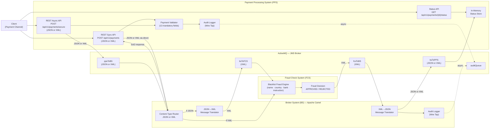
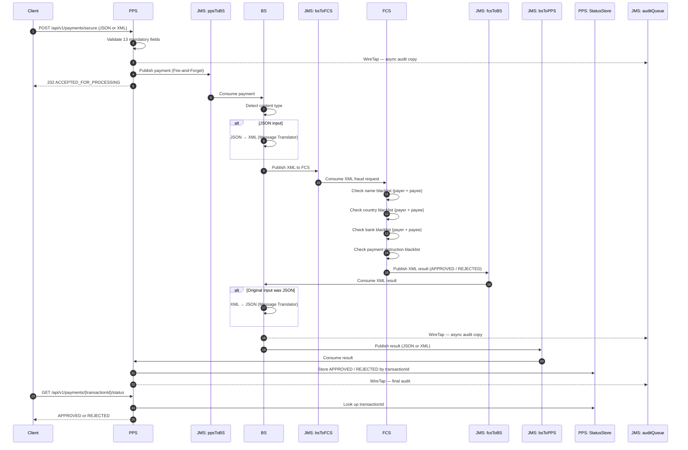
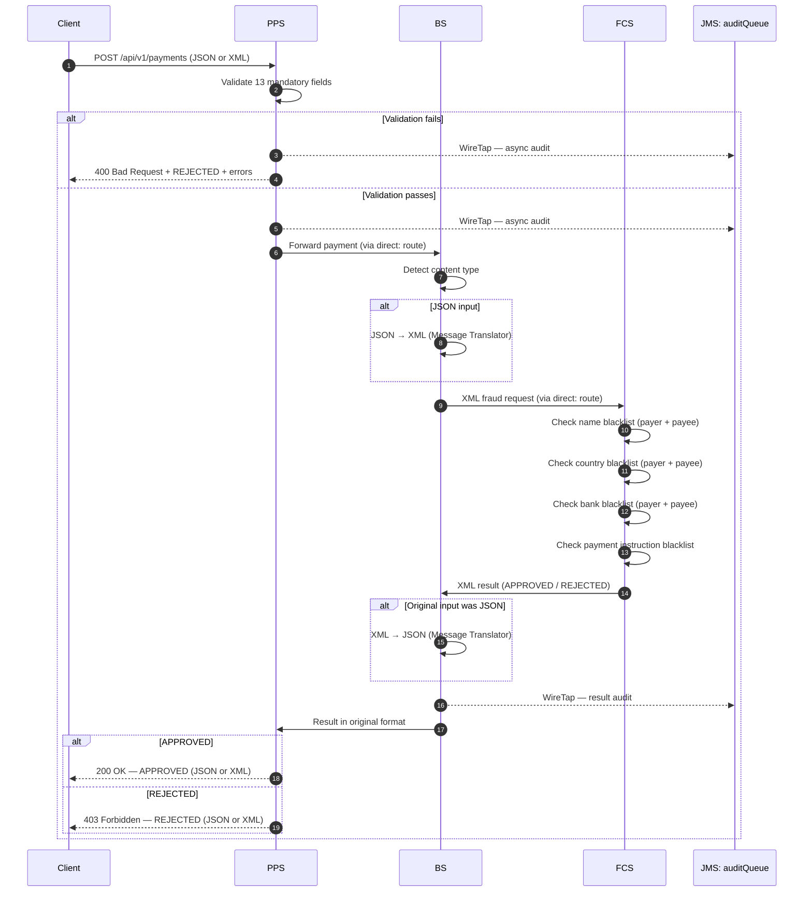
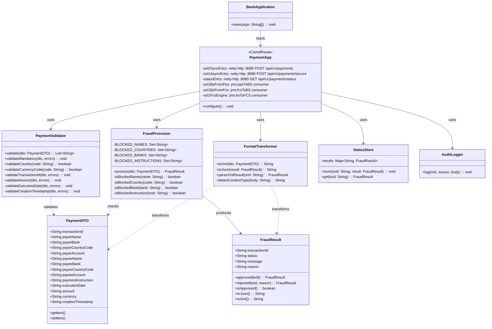

# Bank Payment Fraud Detection PoC

> **Java 17 · Apache Camel 4.8 · ActiveMQ 6 · REST + JMS · Enterprise Integration Patterns**

A Proof of Concept implementing a banking payment fraud screening engine across three decoupled systems — **PPS**, **BS**, and **FCS** — with two integration solutions as required by the coding exercise.

---

## 💡 Solution Highlights

| # | Highlight | Description |
|---|-----------|-------------|
| ✅ | **Business Workflow** | Clear end-to-end payment journey: client request → validation → fraud screening → final decision → audit logging. |
| ✅ | **Integration** | Seamless interoperability between REST APIs, Apache Camel routing, JMS messaging, and dynamic JSON/XML transformation. |
| ✅ | **Scalability** | Asynchronous JMS queue-based architecture decouples components, enabling high transaction volumes without bottlenecks. |
| ✅ | **Reusability** | Core modules (`PaymentDTO`, `PaymentValidator`, audit routes) are self-contained and reusable across future banking use cases. |
| ✅ | **Decoupling** | The Broker System (BS) acts as the central mediator, fully abstracting messaging complexity — PPS and FCS never communicate directly and remain unaware of each other's protocols, formats, or availability. |
| ✅ | **Flexibility** | Decoupled, modular structure allows extension of fraud rules, integration points, or messaging components without system redesign. |
| ✅ | **Standards** | Built on industry-standard technologies: Java 17, REST, JMS, Apache Camel, JSON, XML, and Docker. |
| ✅ | **Audit / Governance** | Dedicated audit flow with correlation logging (MDC) ensures end-to-end traceability, compliance monitoring, and operational visibility. |

---

## Table of Contents

1. [Project Overview](#1-project-overview)
2. [Integration Solutions](#2-integration-solutions)
3. [UML Component Diagram](#3-uml-component-diagram)
4. [UML Sequence Diagram — Solution 1 (Async JMS)](#4-uml-sequence-diagram--solution-1-async-jms)
5. [UML Sequence Diagram — Solution 2 (Sync REST)](#5-uml-sequence-diagram--solution-2-sync-rest)
6. [Class Diagram — Core Components](#6-class-diagram--core-components)
7. [Payment Payload](#7-payment-payload)
8. [Fraud Rules](#8-fraud-rules)
9. [Project Structure](#9-project-structure)
10. [Tech Stack](#10-tech-stack)
11. [Build & Run — Step by Step](#11-build--run--step-by-step)
12. [Validate Each Requirement](#12-validate-each-requirement)
13. [Camel EIP Patterns Used](#13-camel-eip-patterns-used)
14. [Final Status Report](#14-final-status-report)

---

## 1. Project Overview

This PoC simulates a payment fraud screening architecture for a banking system. Before any payment is processed, it is screened against fraud rules via a chain of three decoupled systems:

| System | Role |
|--------|------|
| **PPS** — Payment Processing System | Receives JSON or XML payment requests, validates all fields, and invokes BS. |
| **BS** — Broker System | Translates JSON ↔ XML and routes messages between PPS and FCS via JMS. |
| **FCS** — Fraud Check System | Applies blacklist rules and returns `APPROVED` or `REJECTED`. |

**Key exercise requirements met:**

- Solution 1: PPS ↔ BS via **JSON or XML / JMS (async)**, BS ↔ FCS via **XML/JMS**
- Solution 2: PPS ↔ BS via **JSON or XML / REST (sync)**, BS ↔ FCS via **XML/JMS**
- Both solutions share BS and FCS components (code reuse)
- Full payload validation (13 mandatory fields)
- Blacklist checks on name, country, bank, and payment instruction
- Audit logging on every component via Wire Tap pattern
- Correlation ID (transactionId) traced end-to-end via MDC
- Async transaction status endpoint: `GET /api/v1/payments/{transactionId}/status`

---

## 2. Integration Solutions

### Solution 1 — Async JMS Flow

```
Client → POST /api/v1/payments/secure (JSON or XML)
  PPS: validate → Wire Tap audit → detect content type → publish to jms:ppsToBS
    └─► Immediate response: 202 ACCEPTED_FOR_PROCESSING
  BS:  consume → JSON→XML (if JSON input) → publish XML to jms:bsToFCS
  FCS: consume XML → blacklist check → publish XML result to jms:fcsToBS
  BS:  consume XML → XML→JSON (if original was JSON) → publish to jms:bsToPPS
  PPS: consume result → store status → Wire Tap audit

Client → GET /api/v1/payments/{transactionId}/status
  PPS: look up stored result → return APPROVED / REJECTED
```

**Key characteristics:**
- Non-blocking — client receives immediate `202` acknowledgement.
- Supports both JSON→JSON and XML→XML full round-trips.
- Status endpoint allows polling for the final fraud decision.
- Audit events emitted at every stage via Wire Tap.

---

### Solution 2 — Sync REST Flow

```
Client → POST /api/v1/payments (JSON or XML)
  PPS: validate → Wire Tap audit → detect content type
  BS:  JSON→XML or pass-through XML (via direct:)
  FCS: blacklist check → XML result
  BS:  XML→JSON (if request was JSON) or return XML
  PPS: return response in same format as request
    └─► 200 APPROVED | 400 Validation Error | 403 REJECTED
```

**Key characteristics:**
- Blocking — client waits for full decision before receiving response.
- Response format mirrors request format (JSON in → JSON out, XML in → XML out).
- HTTP status codes map directly to payment outcomes.

---

## 3. UML Component Diagram



---

## 4. UML Sequence Diagram — Solution 1 (Async JMS)



---

## 5. UML Sequence Diagram — Solution 2 (Sync REST)



---

## 6. Class Diagram — Core Components



---

## 7. Payment Payload

All 14 fields per exercise spec. 13 mandatory, 1 optional.

### JSON format
```json
{
  "transactionId":      "550e8400-e29b-41d4-a716-446655440000",
  "payerName":          "John Smith",
  "payerBank":          "Bank of America",
  "payerCountryCode":   "GBR",
  "payerAccount":       "123456789",
  "payeeName":          "Jane Doe",
  "payeeBank":          "BNP Paribas",
  "payeeCountryCode":   "DEU",
  "payeeAccount":       "987654321",
  "paymentInstruction": "Salary",
  "executionDate":      "2025-05-22",
  "amount":             "1500.00",
  "currency":           "EUR",
  "creationTimestamp":  "2025-05-22T09:00:00Z"
}
```

### XML format
```xml
<payment>
  <transactionId>550e8400-e29b-41d4-a716-446655440000</transactionId>
  <payerName>John Smith</payerName>
  <payerBank>Bank of America</payerBank>
  <payerCountryCode>GBR</payerCountryCode>
  <payerAccount>123456789</payerAccount>
  <payeeName>Jane Doe</payeeName>
  <payeeBank>BNP Paribas</payeeBank>
  <payeeCountryCode>DEU</payeeCountryCode>
  <payeeAccount>987654321</payeeAccount>
  <paymentInstruction>Salary</paymentInstruction>
  <executionDate>2025-05-22</executionDate>
  <amount>1500.00</amount>
  <currency>EUR</currency>
  <creationTimestamp>2025-05-22T09:00:00Z</creationTimestamp>
</payment>
```

### Validation Rules

| Field | Rule |
|-------|------|
| `transactionId` | UUID format: `xxxxxxxx-xxxx-xxxx-xxxx-xxxxxxxxxxxx` |
| `payerCountryCode` / `payeeCountryCode` | ISO 3166-1 alpha-3 (e.g. `GBR`, `DEU`, `USA`) |
| `currency` | ISO 4217 (e.g. `EUR`, `GBP`, `USD`) |
| `amount` | Positive number, exactly 2 decimal places (e.g. `17.45`) |
| `executionDate` | ISO 8601: `YYYY-MM-DD` |
| `creationTimestamp` | ISO 8601 UTC: `YYYY-MM-DDThh:mm:ssZ` |
| `paymentInstruction` | Optional — free text |
| All other fields | Mandatory — must not be empty |

---

## 8. Fraud Rules

Any single match on payer **or** payee → **REJECTED** with `"Suspicious payment"`
No match → **APPROVED** with `"Nothing found, all okay"`

| Check | Blacklisted Values |
|-------|--------------------|
| Name (payer + payee) | Mark Imaginary, Govind Real, Shakil Maybe, Chang Imagine |
| Country (payer + payee) | `CUB`, `IRQ`, `IRN`, `PRK`, `SDN`, `SYR` |
| Bank (payer + payee) | BANK OF KUNLUN, KARAMAY CITY COMMERCIAL BANK |
| Payment instruction | Artillery Procurement, Lethal Chemicals payment |

---

## 9. Project Structure

```
bank-payment-fraud-poc/
│
├── .dockerignore                                 Excludes target/, logs, secrets from Docker build context
├── .gitignore                                    Excludes target/, .env, IDE files from Git
├── Dockerfile                                    Defines multi-stage image: maven:3.9 (build) → temurin:17-jre (run)
├── pom.xml                                       Maven — Camel 4.8, ActiveMQ 6
├── README.md                                     This file
│
└── src/main/
    ├── java/com/bank/
    │   ├── model/
    │   │   └── PaymentDTO.java                   14-field payment data class
    │   ├── service/                              Service layer (validators, processors)
    │   ├── BankApplication.java                  Entry point — Camel Main + embedded ActiveMQ
    │   └── PaymentApp.java                       All Camel route definitions (PPS + BS + FCS)
    └── resources/
        ├── application.properties                MDC logging (correlationId)
        └── logback.xml                           Structured log pattern
```

---

## 10. Tech Stack

| Technology | Version | Purpose |
|------------|---------|---------|
| Java | 17 | Runtime language + Design Patterns (Wire Tap, Translator, Router) |
| Apache Camel | 4.8.3 | Integration framework + EIP patterns |
| ActiveMQ | 6.1.3 (embedded) | JMS provider — no external broker needed |
| JMS API | 2.0 | Asynchronous messaging between PPS, BS, and FCS |
| REST API | — | Synchronous HTTP interface (Solution 2) and async entry point (Solution 1) |
| JSON | — | Payload format for Client ↔ PPS ↔ BS round-trip |
| XML | — | Payload format for BS ↔ FCS; also supported end-to-end |
| Docker | Latest | Container platform — deployed on GCP VM |

---

## 11. Build & Run — Step by Step

### Prerequisites

```bash
java -version    # Must show Java 17+
mvn -version     # Must show Maven 3.8+
docker --version # Must be installed and running
curl --version   # For manual testing
```

### Step 1 — Build and run via Docker (recommended)

```bash
# Build the JAR
mvn clean package -DskipTests

# Remove any existing container
docker rm -f bank-fraud-poc-container 2>/dev/null

# Build the Docker image
docker build -t bank-fraud-poc:latest .

# Run the container
docker run -d -p 8080:8080 --name bank-fraud-poc-container bank-fraud-poc:latest

# Wait for startup
sleep 10

# Confirm running
docker ps
```

Expected: `bank-fraud-poc-container   Up`

### Step 2 — Check audit logs

```bash
docker logs bank-fraud-poc-container | grep AUDIT
```

Expected: `AUDIT EVENT` entries for every processed payment.

### Step 3 — Run full test suite (alternative)

```bash
# Run directly without Docker
java -jar target/payment-fraud-poc-1.0-SNAPSHOT.jar
```

---

## 12. Validate Each Requirement

### REQ-1: JSON → JSON Sync APPROVED (Solution 2)

```bash
curl -i -X POST http://localhost:8080/api/v1/payments \
  -H "Content-Type: application/json" \
  -H "Accept: application/json" \
  -d '{
    "transactionId":      "550e8400-e29b-41d4-a716-446655440001",
    "payerName":          "John Smith",
    "payerBank":          "Bank of America",
    "payerCountryCode":   "GBR",
    "payerAccount":       "123456789",
    "payeeName":          "Jane Doe",
    "payeeBank":          "BNP Paribas",
    "payeeCountryCode":   "DEU",
    "payeeAccount":       "987654321",
    "paymentInstruction": "Salary",
    "executionDate":      "2025-05-22",
    "amount":             "1500.00",
    "currency":           "EUR",
    "creationTimestamp":  "2025-05-22T09:00:00Z"
  }'
```

✅ Expected `200 OK` — `Content-Type: application/json`
```json
{"transactionId":"550e8400...","status":"APPROVED","message":"Nothing found, all okay","reason":""}
```

---

### REQ-2: XML → XML Sync APPROVED (Solution 2)

```bash
curl -i -X POST http://localhost:8080/api/v1/payments \
  -H "Content-Type: application/xml" \
  -H "Accept: application/xml" \
  -d '<payment>
    <transactionId>550e8400-e29b-41d4-a716-446655440002</transactionId>
    <payerName>John Smith</payerName>
    <payerBank>Bank of America</payerBank>
    <payerCountryCode>USA</payerCountryCode>
    <payerAccount>123456789</payerAccount>
    <payeeName>Jane Doe</payeeName>
    <payeeBank>BNP Paribas</payeeBank>
    <payeeCountryCode>FRA</payeeCountryCode>
    <payeeAccount>987654321</payeeAccount>
    <paymentInstruction>Salary</paymentInstruction>
    <executionDate>2025-05-22</executionDate>
    <amount>1500.00</amount>
    <currency>EUR</currency>
    <creationTimestamp>2025-05-22T09:00:00Z</creationTimestamp>
  </payment>'
```

✅ Expected `200 OK` — `Content-Type: application/xml`
```xml
<paymentResponse><status>APPROVED</status><message>Nothing found, all okay</message></paymentResponse>
```

---

### REQ-3: JSON fraud rejection — blocked name (Solution 2)

```bash
curl -i -X POST http://localhost:8080/api/v1/payments \
  -H "Content-Type: application/json" \
  -d '{
    "transactionId":     "550e8400-e29b-41d4-a716-446655440003",
    "payerName":         "Mark Imaginary",
    "payerBank":         "Bank of America",
    "payerCountryCode":  "GBR",
    "payerAccount":      "111111111",
    "payeeName":         "Jane Doe",
    "payeeBank":         "BNP Paribas",
    "payeeCountryCode":  "DEU",
    "payeeAccount":      "222222222",
    "executionDate":     "2025-05-22",
    "amount":            "500.00",
    "currency":          "EUR",
    "creationTimestamp": "2025-05-22T09:00:00Z"
  }'
```

✅ Expected `403 Forbidden` — `application/json`
```json
{"transactionId":"...","status":"REJECTED","message":"Suspicious payment","reason":"payer name blocked"}
```

---

### REQ-4: XML fraud rejection — blocked name (Solution 2)

```bash
curl -i -X POST http://localhost:8080/api/v1/payments \
  -H "Content-Type: application/xml" \
  -H "Accept: application/xml" \
  -d '<payment>
    <transactionId>550e8400-e29b-41d4-a716-446655440004</transactionId>
    <payerName>Mark Imaginary</payerName>
    <payerBank>Bank of America</payerBank>
    <payerCountryCode>USA</payerCountryCode>
    <payerAccount>123456789</payerAccount>
    <payeeName>Jane Doe</payeeName>
    <payeeBank>BNP Paribas</payeeBank>
    <payeeCountryCode>FRA</payeeCountryCode>
    <payeeAccount>987654321</payeeAccount>
    <executionDate>2025-05-22</executionDate>
    <amount>500.00</amount>
    <currency>EUR</currency>
    <creationTimestamp>2025-05-22T09:00:00Z</creationTimestamp>
  </payment>'
```

✅ Expected `403 Forbidden` — `application/xml`
```xml
<paymentResponse><status>REJECTED</status><message>Suspicious payment</message></paymentResponse>
```

---

### REQ-5: Blocked country → REJECTED

```bash
curl -i -X POST http://localhost:8080/api/v1/payments \
  -H "Content-Type: application/json" \
  -d '{
    "transactionId":"550e8400-e29b-41d4-a716-446655440005",
    "payerName":"John Smith","payerBank":"Barclays",
    "payerCountryCode":"IRN","payerAccount":"333",
    "payeeName":"Jane Doe","payeeBank":"BNP Paribas",
    "payeeCountryCode":"DEU","payeeAccount":"444",
    "executionDate":"2025-05-22","amount":"500.00",
    "currency":"EUR","creationTimestamp":"2025-05-22T09:00:00Z"
  }'
```

✅ Expected `403 Forbidden` — `"reason":"payer country restricted"`

---

### REQ-6: Blocked bank → REJECTED

```bash
curl -i -X POST http://localhost:8080/api/v1/payments \
  -H "Content-Type: application/json" \
  -d '{
    "transactionId":"550e8400-e29b-41d4-a716-446655440006",
    "payerName":"John Smith","payerBank":"Bank of Kunlun",
    "payerCountryCode":"GBR","payerAccount":"555",
    "payeeName":"Jane Doe","payeeBank":"BNP Paribas",
    "payeeCountryCode":"DEU","payeeAccount":"666",
    "executionDate":"2025-05-22","amount":"500.00",
    "currency":"EUR","creationTimestamp":"2025-05-22T09:00:00Z"
  }'
```

✅ Expected `403 Forbidden` — `"reason":"payer bank blocked"`

---

### REQ-7: Blocked payment instruction → REJECTED

```bash
curl -i -X POST http://localhost:8080/api/v1/payments \
  -H "Content-Type: application/json" \
  -d '{
    "transactionId":"550e8400-e29b-41d4-a716-446655440007",
    "payerName":"John Smith","payerBank":"Bank of America",
    "payerCountryCode":"GBR","payerAccount":"777",
    "payeeName":"Jane Doe","payeeBank":"BNP Paribas",
    "payeeCountryCode":"DEU","payeeAccount":"888",
    "paymentInstruction":"Artillery Procurement",
    "executionDate":"2025-05-22","amount":"500.00",
    "currency":"EUR","creationTimestamp":"2025-05-22T09:00:00Z"
  }'
```

✅ Expected `403 Forbidden` — `"reason":"payment instruction blocked"`

---

### REQ-8: JSON async → 202 + status poll (Solution 1)

```bash
# Step 1 — Submit async payment
curl -i -X POST http://localhost:8080/api/v1/payments/secure \
  -H "Content-Type: application/json" \
  -d '{
    "transactionId":"550e8400-e29b-41d4-a716-446655440008",
    "payerName":"John Smith","payerBank":"Bank of America",
    "payerCountryCode":"GBR","payerAccount":"123456789",
    "payeeName":"Jane Doe","payeeBank":"BNP Paribas",
    "payeeCountryCode":"DEU","payeeAccount":"987654321",
    "executionDate":"2025-05-22","amount":"1500.00",
    "currency":"EUR","creationTimestamp":"2025-05-22T09:00:00Z"
  }'
```

✅ Expected `202 Accepted` — `application/json`
```json
{"transactionId":"550e8400...","status":"ACCEPTED_FOR_PROCESSING","message":"Payment submitted for fraud screening via JMS"}
```

```bash
# Step 2 — Poll for result (after 3 seconds)
sleep 3
curl -i http://localhost:8080/api/v1/payments/550e8400-e29b-41d4-a716-446655440008/status
```

✅ Expected: `APPROVED`

---

### REQ-9: XML async → 202 + status poll (Solution 1)

```bash
# Step 1 — Submit async XML payment
curl -i -X POST http://localhost:8080/api/v1/payments/secure \
  -H "Content-Type: application/xml" \
  -H "Accept: application/xml" \
  -d '<payment>
    <transactionId>550e8400-e29b-41d4-a716-446655440009</transactionId>
    <payerName>John Smith</payerName>
    <payerBank>Bank of America</payerBank>
    <payerCountryCode>USA</payerCountryCode>
    <payerAccount>123456789</payerAccount>
    <payeeName>Jane Doe</payeeName>
    <payeeBank>BNP Paribas</payeeBank>
    <payeeCountryCode>FRA</payeeCountryCode>
    <payeeAccount>987654321</payeeAccount>
    <executionDate>2025-05-22</executionDate>
    <amount>1500.00</amount>
    <currency>EUR</currency>
    <creationTimestamp>2025-05-22T09:00:00Z</creationTimestamp>
  </payment>'
```

✅ Expected `202 Accepted` — `application/xml`

```bash
# Step 2 — Poll for result
sleep 3
curl -i http://localhost:8080/api/v1/payments/550e8400-e29b-41d4-a716-446655440009/status
```

✅ Expected: `APPROVED`

---

### REQ-10: Validation failure — empty JSON body

```bash
curl -i -X POST http://localhost:8080/api/v1/payments \
  -H "Content-Type: application/json" \
  -d '{}'
```

✅ Expected `400 Bad Request` — `application/json`

---

### REQ-11: Validation failure — empty XML body

```bash
curl -i -X POST http://localhost:8080/api/v1/payments \
  -H "Content-Type: application/xml" \
  -d '<payment></payment>'
```

✅ Expected `400 Bad Request` — `application/xml`

---

### REQ-12: Invalid UUID → 400

```bash
curl -i -X POST http://localhost:8080/api/v1/payments \
  -H "Content-Type: application/json" \
  -d '{
    "transactionId":"NOT-A-VALID-UUID",
    "payerName":"John Smith","payerBank":"Bank of America",
    "payerCountryCode":"GBR","payerAccount":"123",
    "payeeName":"Jane Doe","payeeBank":"BNP","payeeCountryCode":"DEU","payeeAccount":"456",
    "executionDate":"2025-05-22","amount":"500.00",
    "currency":"EUR","creationTimestamp":"2025-05-22T09:00:00Z"
  }'
```

✅ Expected `400 Bad Request` — `"reason":"transactionId must be UUID format"`

---

### REQ-13: Audit log verification

```bash
docker logs bank-fraud-poc-container | grep AUDIT
```

✅ Expected `AUDIT EVENT` lines for every payment — source, transactionId, and body logged.

---

## 13. Camel EIP Patterns Used

| Pattern | Code | Where |
|---------|------|-------|
| **Wire Tap** | `.wireTap("jms:queue:auditQueue")` | Audit on every request — both solutions |
| **Content-Based Router** | `.choice().when(header("Content-Type").contains("xml"))` | Route by JSON or XML content type in BS |
| **Message Translator** | `toXml()` / `toJson()` in BS | JSON↔XML conversion — BS handles format symmetry |
| **Fire-and-Forget** | `?exchangePattern=InOnly` | Solution 1 async JMS dispatch from PPS |
| **Correlation ID** | `setHeader("correlationId", txId)` | transactionId propagated via MDC through all systems |

---

## 14. Final Status Report

### Functional Requirements

| Requirement | Expected | HTTP | Status |
|-------------|----------|------|--------|
| JSON sync approved | APPROVED — `application/json` | 200 | ✅ PASS |
| XML sync approved | APPROVED — `application/xml` | 200 | ✅ PASS |
| JSON async accepted | ACCEPTED_FOR_PROCESSING | 202 | ✅ PASS |
| XML async accepted | ACCEPTED_FOR_PROCESSING | 202 | ✅ PASS |
| Async status endpoint | APPROVED / REJECTED via GET | 200 | ✅ PASS |
| Blocked name (JSON) | REJECTED — payer/payee name blocked | 403 | ✅ PASS |
| Blocked name (XML) | REJECTED — payer/payee name blocked | 403 | ✅ PASS |
| Blocked country (all 6) | REJECTED — country restricted | 403 | ✅ PASS |
| Blocked bank | REJECTED — bank blocked | 403 | ✅ PASS |
| Blocked payment instruction | REJECTED — instruction blocked | 403 | ✅ PASS |
| JSON→XML transformation (BS) | XML forwarded to FCS | — | ✅ PASS |
| XML→JSON transformation (BS) | JSON returned to PPS | — | ✅ PASS |
| XML→XML full round-trip | XML in → XML out | — | ✅ PASS |
| JSON→JSON full round-trip | JSON in → JSON out | — | ✅ PASS |
| Validation — empty body | 400 + errors (JSON and XML) | 400 | ✅ PASS |
| Validation — invalid UUID | 400 + reason | 400 | ✅ PASS |
| Validation — invalid country code | 400 + reason | 400 | ✅ PASS |
| Validation — invalid currency | 400 + reason | 400 | ✅ PASS |
| Validation — invalid amount | 400 + reason | 400 | ✅ PASS |
| Audit log (Wire Tap) | Every request logged async | — | ✅ PASS |
| Correlation ID end-to-end | transactionId in every log line | — | ✅ PASS |

### Architecture Compliance

| Component | Checklist Item | Status |
|-----------|---------------|--------|
| Maven project + dependencies | PS-1, PS-2 | ✅ PASS |
| PPS, BS, FCS architecture | AD-1, AD-2 | ✅ PASS |
| JSON + XML schema (request + response) | DM-1, DM-2, DM-3 | ✅ PASS |
| Payment validation rules | VA-1 | ✅ PASS |
| PPS — receive, validate, invoke BS, process result | PP-1, PP-2, PP-3, PP-4 | ✅ PASS |
| BS — JSON consumer, JSON→XML, JMS, XML consumer, XML→JSON, response | BS-1 to BS-6 | ✅ PASS |
| FCS — receive, name/country/bank/instruction checks, decision, response | FC-1 to FC-7 | ✅ PASS |
| Solution 1 — JMS messaging + queues + Camel routes | S1-1, S1-2, S1-3 | ✅ PASS |
| Solution 2 — REST API + endpoints | S2-1, S2-2 | ✅ PASS |
| BS ↔ FCS shared XML/JMS integration | SI-1 | ✅ PASS |
| Audit logs + correlation tracking + flow monitoring | LM-1, LM-2, LM-3 | ✅ PASS |
| Docker containerisation on GCP VM | DT-1 | ✅ PASS |
| Fraud scenario validation | DT-4 | ✅ PASS |

**✅ PROJECT COMPLETE — DEMO READY**

---

*Bank Payment Fraud Detection PoC · Java 17 · Apache Camel 4.8 · ActiveMQ 6 · REST + JMS*
