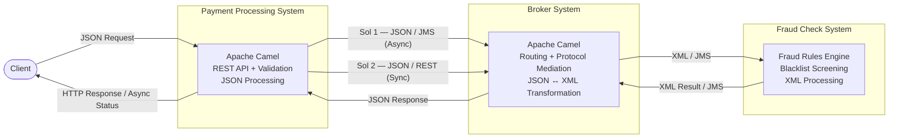
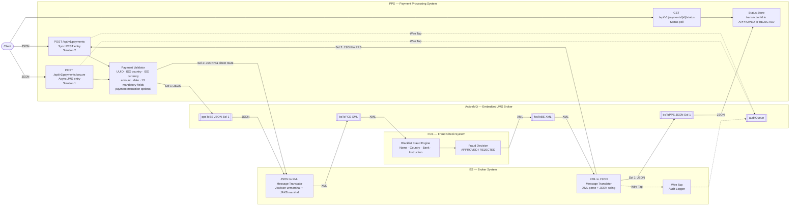
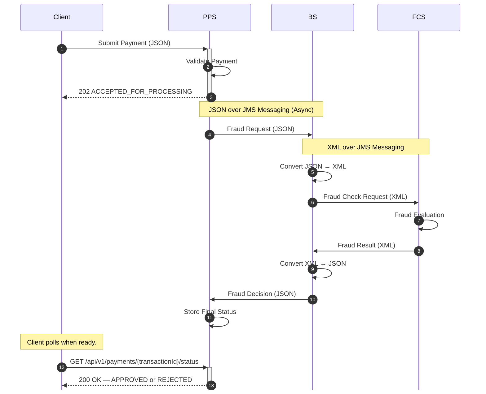
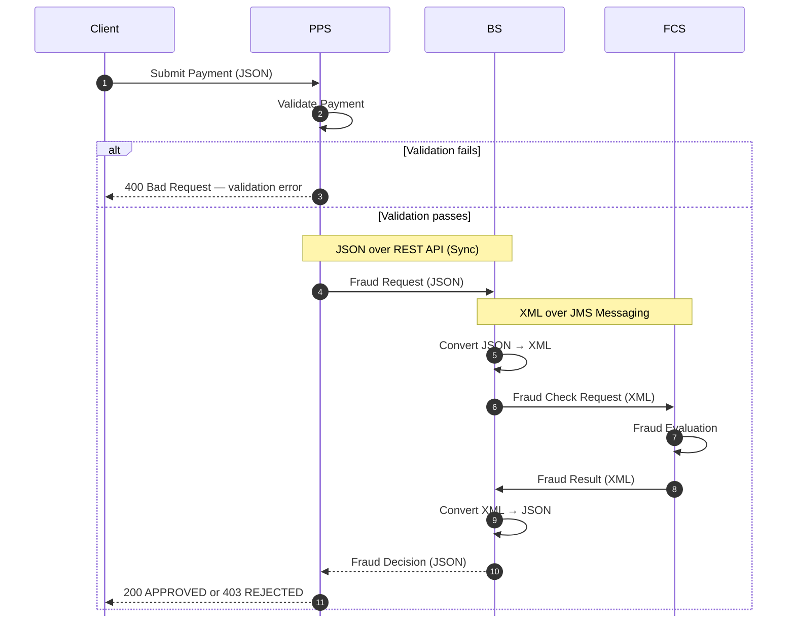

# Bank Payment Fraud Detection PoC

> **Java 17 · Apache Camel 4.8 · ActiveMQ 6 · JMS + REST · JSON + XML**

A Proof of Concept demonstrating two payment fraud detection integration solutions using Apache Camel, ActiveMQ, REST APIs, and JMS messaging — designed to showcase architectural design, protocol mediation, and synchronous vs asynchronous communication patterns.

---

## 1. PoC Objective

This PoC demonstrates a secure, decoupled payment fraud screening solution across three systems.

The goal is to validate two integration approaches — synchronous REST and asynchronous JMS — while keeping the fraud logic and protocol mediation fully decoupled from the client-facing payment API.

### Core Design Rules

| Rule | Detail |
|---|---|
| PPS communicates in | **JSON only** |
| FCS communicates in | **XML only** |
| BS is responsible for | **all JSON ↔ XML translation** |
| BS ↔ FCS always uses | **JMS messaging** |
| PPS ↔ BS varies by solution | **JMS (Sol 1) or REST (Sol 2)** |

---

## 2. Systems Overview

| System | Full Name | Role |
|---|---|---|
| **PPS** | Payment Processing System | Receives JSON payment requests · validates all fields · manages client interaction · triggers fraud screening |
| **BS** | Broker System | Protocol mediator · converts JSON ↔ XML · routes between PPS and FCS · decouples the two systems |
| **FCS** | Fraud Check System | Receives XML from BS · applies blacklist rules · returns APPROVED or REJECTED in XML |

---

## 3. Integration Solutions

| | PPS to BS | Format | BS to FCS | Format | Client response |
|---|---|---|---|---|---|
| **Solution 1** | JMS Messaging | JSON | JMS Messaging | XML | 202 immediately — client polls for result |
| **Solution 2** | REST API | JSON | JMS Messaging | XML | 200 or 403 synchronously — client waits |

> BS to FCS is **always XML over JMS** in both solutions.
> Only the transport between PPS and BS differs.

---

## 4. End-to-End Workflow



---

## 5. UML Component Diagram



---

## 6. UML Sequence Diagram — Solution 1 Asynchronous

> Client receives **202 immediately**. Fraud check runs in the background. Client polls for result.



---

## 7. UML Sequence Diagram — Solution 2 Synchronous

> Client **waits** on the same HTTP connection and receives a direct response.



---

## 8. System Responsibilities

### PPS — Payment Processing System
- Accept JSON payment requests
- Validate request payload
- Trigger synchronous or asynchronous fraud screening
- Store async processing status

### BS — Broker System
- Route requests between PPS and FCS
- Transform JSON ↔ XML
- Handle protocol mediation

### FCS — Fraud Check System
- Execute fraud screening rules
- Return APPROVED / REJECTED decision

---

## 9. Payment Payload

### JSON Request — Client to PPS

```json
{
  "transactionId":      "550e8400-e29b-41d4-a716-446655440000",
  "payerName":          "John Smith",
  "payerBank":          "Bank of America",
  "payerCountryCode":   "GBR",
  "payerAccount":       "123456789",
  "payeeName":          "Jane Doe",
  "payeeBank":          "BNP Paribas",
  "payeeCountryCode":   "DEU",
  "payeeAccount":       "987654321",
  "paymentInstruction": "Salary",
  "executionDate":      "2025-05-22",
  "amount":             "1500.00",
  "currency":           "EUR",
  "creationTimestamp":  "2025-05-22T09:00:00Z"
}
```

### XML Format — BS to FCS (internal only)

```xml
<payment>
  <transactionId>550e8400-e29b-41d4-a716-446655440000</transactionId>
  <payerName>John Smith</payerName>
  <payerBank>Bank of America</payerBank>
  <payerCountryCode>GBR</payerCountryCode>
  <payerAccount>123456789</payerAccount>
  <payeeName>Jane Doe</payeeName>
  <payeeBank>BNP Paribas</payeeBank>
  <payeeCountryCode>DEU</payeeCountryCode>
  <payeeAccount>987654321</payeeAccount>
  <paymentInstruction>Salary</paymentInstruction>
  <executionDate>2025-05-22</executionDate>
  <amount>1500.00</amount>
  <currency>EUR</currency>
  <creationTimestamp>2025-05-22T09:00:00Z</creationTimestamp>
</payment>
```

### Validation

Validation includes:

- UUID format
- ISO 3166-1 alpha-3 country codes
- ISO 4217 currency
- amount precision
- ISO 8601 date/timestamp
- mandatory field checks

`paymentInstruction` is optional.

---

## 10. Fraud Rules

Any single match on payer **or** payee triggers rejection.

| Outcome | Message | HTTP |
|---|---|---|
| No match | `Nothing found, all okay` | 200 |
| Any match | `Suspicious payment` | 403 |

Fraud checks cover: blocked payer/payee names · restricted countries (sanctioned states) · sanctioned banks · prohibited payment instructions.

---

## 11. Project Structure

```
bank-payment-fraud-poc/
|
+-- pom.xml                          Maven build — Camel 4.8, ActiveMQ 6
+-- Dockerfile                       Multi-stage: maven:3.9 build to temurin:17-jre run
+-- .gitignore                       Ignore target/, IDE files, logs, temp artifacts
+-- README.md                        This file
|
+-- src/
    +-- main/
        +-- java/com/bank/
        |   +-- BankApplication.java      Entry point — Camel Main + embedded ActiveMQ
        |   +-- PaymentApp.java           All Camel routes — PPS, BS, FCS logic
        |   +-- model/
        |   |   +-- PaymentDTO.java       14-field POJO — Jackson JSON + JAXB XML
        |   +-- service/
        |       +-- PaymentValidator.java PPS validation — 13 mandatory fields, paymentInstruction optional
        +-- resources/
            +-- application.properties   MDC logging — correlationId tracking
            +-- logback.xml              Structured log pattern with correlationId
```

| File | Responsibility |
|---|---|
| `BankApplication.java` | Starts Camel Main · binds embedded ActiveMQ · registers all routes |
| `PaymentApp.java` | All business logic — 8 Camel routes covering PPS, BS, FCS for both solutions |
| `PaymentDTO.java` | Shared data model — Jackson for JSON · JAXB for XML in one POJO |
| `PaymentValidator.java` | Validates UUID · ISO country · ISO currency · amount · date · 13 mandatory fields · `paymentInstruction` is optional |

---

## 12. Technology Stack

| Technology | Purpose |
|---|---|
| Java 17 | Runtime |
| Apache Camel 4.8 | Integration framework — routing, EIP patterns, Wire Tap |
| ActiveMQ 6 (embedded) | JMS messaging |
| REST API (Netty HTTP) | Synchronous client communication — Solution 2 |
| JSON / XML | Data exchange formats — PPS uses JSON, FCS uses XML |
| Google Cloud Platform (GCP) | Cloud hosting / container runtime |

---

## 13. Build and Run

### Build

```bash
mvn clean package -DskipTests
```

### Run Locally

```bash
java -jar target/payment-fraud-poc-1.0-SNAPSHOT.jar
```

### Run with Docker

```bash
docker build -t bank-fraud-poc .
docker run -d -p 8080:8080 --name bank-fraud-poc-container bank-fraud-poc
docker logs -f bank-fraud-poc-container
```

> **GCP deployment:** Application runs containerised on a Google Compute Engine VM. Structured logs with correlationId are visible in Google Cloud Logging.

---

## 14. API Endpoints

| Method | Endpoint | Solution | Pattern | Response |
|---|---|---|---|---|
| `POST` | `/api/v1/payments` | Solution 2 | Synchronous | 200 APPROVED · 403 REJECTED · 400 INVALID |
| `POST` | `/api/v1/payments/secure` | Solution 1 | Asynchronous | 202 ACCEPTED_FOR_PROCESSING |
| `GET` | `/api/v1/payments/{transactionId}/status` | Solution 1 | Status poll | 200 APPROVED or REJECTED · 404 NOT_FOUND |

### Example — Solution 2 Synchronous (Approved)

```bash
curl -i -X POST http://localhost:8080/api/v1/payments \
  -H "Content-Type: application/json" \
  -d '{
    "transactionId":      "550e8400-e29b-41d4-a716-446655440001",
    "payerName":          "John Smith",
    "payerBank":          "Bank of America",
    "payerCountryCode":   "GBR",
    "payerAccount":       "123456789",
    "payeeName":          "Jane Doe",
    "payeeBank":          "BNP Paribas",
    "payeeCountryCode":   "DEU",
    "payeeAccount":       "987654321",
    "executionDate":      "2025-05-22",
    "amount":             "1500.00",
    "currency":           "EUR",
    "creationTimestamp":  "2025-05-22T09:00:00Z"
  }'
```

Response — HTTP 200:
```json
{"transactionId":"550e8400...","status":"APPROVED","message":"Nothing found, all okay","reason":""}
```

### Example — Solution 1 Asynchronous (Submit + Poll)

```bash
# Submit
curl -i -X POST http://localhost:8080/api/v1/payments/secure \
  -H "Content-Type: application/json" \
  -d '{
    "transactionId":"660e8400-e29b-41d4-a716-446655440010",
    "payerName":"John Smith","payerBank":"Bank of America",
    "payerCountryCode":"GBR","payerAccount":"123456789",
    "payeeName":"Jane Doe","payeeBank":"BNP Paribas",
    "payeeCountryCode":"DEU","payeeAccount":"987654321",
    "executionDate":"2025-05-22","amount":"1500.00",
    "currency":"EUR","creationTimestamp":"2025-05-22T09:00:00Z"
  }'
```

Response — HTTP 202 immediate:
```json
{"transactionId":"660e8400...","status":"ACCEPTED_FOR_PROCESSING","message":"Payment submitted for fraud screening via JMS"}
```

```bash
# Poll for result
sleep 3 && curl -i http://localhost:8080/api/v1/payments/660e8400-e29b-41d4-a716-446655440010/status
```

Response — HTTP 200:
```json
{"transactionId":"660e8400...","status":"APPROVED"}
```

---

*Bank Payment Fraud Detection PoC — Java 17 · Apache Camel 4.8 · ActiveMQ 6 · REST + JMS*
